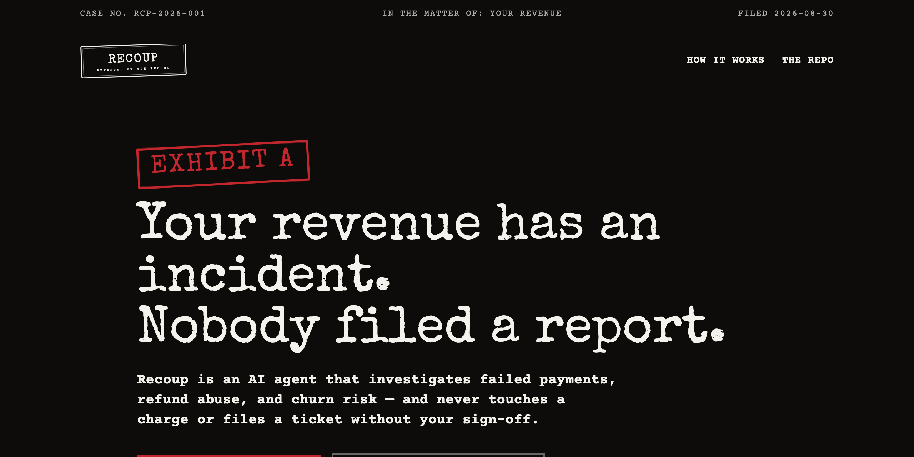
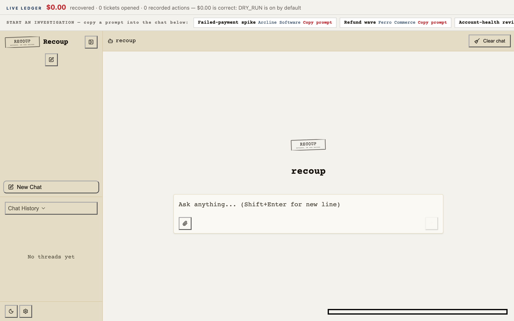
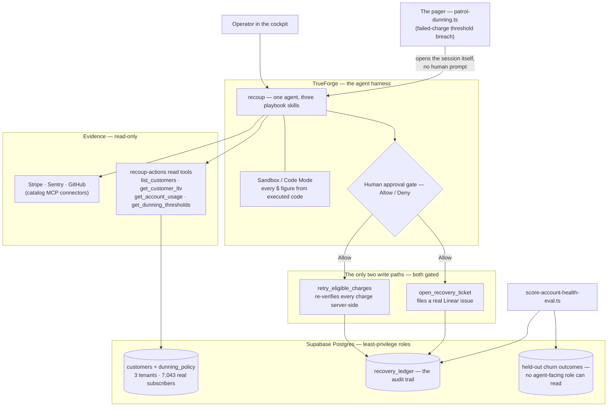

<p align="center">
  <a href="https://recoup-landing-377323041120.asia-northeast1.run.app">
    
  </a>
</p>

# Recoup — an SRE for revenue

> Your uptime has an on-call engineer. Your revenue doesn't — until now.

Built on [TrueForge](https://trueforge.dev) for **The Agent Harness Hackathon**
(TrueFoundry × Qodo). Recoup investigates a revenue incident — a failed-payment spike, a
refund wave, a renewal-risk signal — the way an SRE investigates an outage: pull evidence
from independent sources, correlate, classify the root cause, compute the exact dollar
impact in executed code, and **stop for a human** before touching a real charge or filing
a real ticket.

**Try it live:**
[the cockpit](https://recoup-cockpit-377323041120.asia-northeast1.run.app) (copy one of
the three desk prompts on screen and watch it work) ·
[the landing page](https://recoup-landing-377323041120.asia-northeast1.run.app) ·
or [run it locally](#run-it-locally).

## Why we built this

A large slice of subscription churn isn't a customer choosing to leave — it's a card
expiring, a bank declining, a webhook silently breaking after a deploy. It's called
*involuntary churn*, it's a real line item on every SaaS P&L, and today it's handled
either by a blanket retry schedule that can't tell a maxed-out card from your own billing
bug, or by a person digging through a payments dashboard after the money is already gone.

Engineering solved this exact problem for uptime decades ago: investigate from multiple
sources, correlate, classify, quantify, act, write it up — and never let the responder
take an irreversible action without review. Recoup applies that discipline to revenue.

The deeper point: the domain expertise lives in **one file per desk** —
[`skills/dunning-playbook/SKILL.md`](./skills/dunning-playbook/SKILL.md),
[`skills/refund-abuse-playbook/SKILL.md`](./skills/refund-abuse-playbook/SKILL.md),
[`skills/account-health-playbook/SKILL.md`](./skills/account-health-playbook/SKILL.md).
Three genuinely different investigations run on the *same* agent, tools, gates, and
ledger, with zero per-desk code. This isn't a payments bot; it's a pattern for turning
any written policy into a gated, investigative agent.

## What an investigation looks like

1. **It starts** — either an operator types a prompt in the cockpit, or nobody does:
   [`scripts/patrol-dunning.ts`](./scripts/patrol-dunning.ts) watches the failed-charge
   count and opens the session itself on a threshold breach. Self-triggered is **not**
   self-approved — a paged session stops at exactly the same gates.
2. **It gathers evidence** — real Stripe test-mode charges and decline codes, Sentry
   error timing, GitHub deploy history, and tenant data (LTV tiers, usage, policy) from
   the custom MCP server, delegating per-source work to sub-agents via the harness's
   `create_sub_agent`.
3. **It classifies before acting** — card-level (ordinary declines, safe to retry) vs.
   platform-level (failures that correlate with *your own* deploy or error spike — a
   retry loop would be harassment; that's an engineering ticket).
4. **It does the math in the sandbox** — every dollar figure is the output of executed
   code, never a number the model eyeballed into prose.
5. **It stops** — the two write tools (`retry_eligible_charges`,
   `open_recovery_ticket`) render a high-stakes approval card and nothing moves until a
   human clicks Allow. And the server doesn't take the agent's word for it even then —
   see [Trust, verified](#trust-verified).

<p align="center">
  <a href="https://recoup-cockpit-377323041120.asia-northeast1.run.app">
    
  </a>
</p>

## Architecture



The deep dive — including the gotchas found while building (why the Supabase catalog
connector had zero usable tools, why the migration needed two explicit transactions, why
Code Mode calls still respect approval gates) — is in
[`docs/ARCHITECTURE.md`](./docs/ARCHITECTURE.md).

## Trust, verified

Three claims most agent demos assert, that this project makes checkable instead:

- **The server never trusts the agent where money is involved.**
  `retry_eligible_charges` fetches each charge's *real* decline code and customer from
  Stripe (not the caller's claim), blocks claimed-vs-real mismatches outright, enforces
  `escalate_to_human_always` LTV tiers, and enforces `max_auto_retry_attempts` from its
  own ledger history — fail-closed. An agent that mislabels a `stolen_card` charge as
  `insufficient_funds` gets a `blocked_never_retry` result, approval click or not.
- **Recovered dollars come from Stripe, not the model.** The headline number sums
  Stripe's own `amount_received`, and the ledger records claimed-vs-actual for every
  batch. `DRY_RUN=true` is the project-wide default; rehearsal runs never inflate the
  number shown as real.
- **The account-health desk is scored against reality, not narrated.** Meridian
  Telecom's population is the real IBM Telco Customer Churn dataset — 7,043 real
  subscribers whose real recorded churn outcome lives in a table **no agent-facing
  database role can read**. [`scripts/score-account-health-eval.ts`](./scripts/score-account-health-eval.ts)
  computes precision/recall against that held-out truth, prints a competing rule-baseline
  over the same reviewed set plus Wilson confidence intervals, persists every run as a
  citable JSON artifact — and states its own limitations in its header instead of hiding
  them (the dataset is public; the reviewed set is agent-selected; a human Deny erases a
  prediction).

## Run it locally

Prereqs: Node ≥ 20, npm.

**The MCP server** (the agent's custom tools — runs fine with zero external accounts in
dry-run mode):

```bash
cd mcp-server
cp .env.example .env   # set MCP_SERVER_TOKEN to any random string; leave DRY_RUN=true
npm ci
npm run dev            # serves http://localhost:8890/mcp (bearer-token auth) and /stats
```

Without `CUSTOMERS_DB_URL`/`RECOVERY_LEDGER_DB_URL` set, the data-backed tools return
honest errors and the two write tools still demonstrate the full policy-check flow in
dry-run. To back them with real data, create a free Supabase project and run
`scripts/seed-supabase.sql` then `scripts/migrate-multi-tenant.sql` against it (each
file's header says exactly what it creates), and optionally import the real churn
population per `scripts/import-telco-population.ts`'s header.

**The cockpit** (the operator UI — needs a running TrueForge instance to talk to):

```bash
# TrueForge itself, if you don't have one: npx @truefoundry/trueforge
cd cockpit
npm ci
npm run build
TRUEFORGE_BASE_URL=http://localhost:8000 node server.mjs   # serves :8080, proxies /api
```

Then create an agent named `recoup` in TrueForge from [`agent-spec.json`](./agent-spec.json)
(Settings → Agents, or `client.agents.create`), register the three skills under
[`skills/`](./skills/), and add the MCP server from step 1 as a connector with header auth.

**The landing page** (static, no dependencies on the above):

```bash
cd landing && npm ci && npm run dev   # http://localhost:5174
```

**The pager** (optional — the agent starts itself):
`npx tsx scripts/patrol-dunning.ts --simulate` fires one investigation immediately for a
rehearsal; without `--simulate` it polls real Stripe test-mode failure counts against the
threshold.

## Bring your own tenant

Arcline, Ferro, and Meridian are demo tenants, not the whole story — the point is that
all three (a B2B SaaS, a subscription retailer, and a consumer telecom, three genuinely
different revenue shapes) run through the exact same `companies` row, the same MCP tools,
and the same three skills, with no per-tenant code branching. Adding a real fourth tenant
is the same three steps as adding Meridian was:

1. **Insert a company + policy.** A row in `public.companies` (`scripts/seed-supabase.sql`
   shows the shape) and a matching `public.dunning_policy` row — thresholds, LTV tiers,
   never-retry decline codes, all data, not code.
2. **Connect its real systems.** Point the Stripe/Sentry/GitHub/Linear catalog connectors
   at that tenant's own accounts in TrueForge's Settings → Connectors — these are live API
   integrations, not fixtures, so a real (or real test-mode) account works unmodified.
3. **Import its customer population**, if it's a usage/churn-shaped business rather than
   a pure Stripe-failures one: `scripts/import-telco-population.ts --company-id
   comp_your_company --csv path/to/your-customers.csv` (the script's header documents the
   expected columns and the one-line download for the reference dataset; override
   `ltvTier()`'s cutoffs if your tenant's thresholds differ from its `dunning_policy`
   row).

Nothing about the agent, the skills, or the approval gates changes — `company_id` is a
parameter on every tool call, not a fixed identity baked into the code.

## What TrueForge and Qodo are doing, concretely

- **TrueForge** runs the whole agent loop: the model, tool calls, skill-directed
  sub-agent delegation (`create_sub_agent`), sandboxed code execution for the
  dollar-impact math, the approval pause before anything irreversible, and the session
  that survives a browser refresh mid-investigation. None of that is hand-rolled — it's
  the harness doing real work, visibly.
- **Qodo** reviewed every pull request in this repo before it merged. See
  [`docs/CODE_QUALITY_BAR.md`](./docs/CODE_QUALITY_BAR.md) for the exact workflow, and
  the evidence section below for a real example.

## How this was built

An AI coding agent built this project under human direction — the human set direction,
reviewed everything, held every key, and made every merge. Every substantive change went
through a GitHub pull request reviewed by Qodo before a human merged it; when a review
surfaced a real defect, the fix went back through the same loop. The commit history reads
accordingly, including the dead ends ("revert the WelcomeScreen slot override — it broke
layout badly") — honest history was a deliberate choice over a curated one.

## Qodo Code Review Evidence

- PR: [#6 — Multi-tenant revenue platform: real Telco Churn data + account-health desk](https://github.com/something1703/recoup/pull/6)
- What Qodo surfaced: across three review rounds, 10 findings — all High severity, all
  fixed, not dismissed. The two worth calling out: `scripts/migrate-multi-tenant.sql`'s
  rerun guard could roll back its own non-destructive setup before reaching the guarded
  section, silently breaking idempotency on an already-migrated database; and
  `scripts/score-account-health-eval.ts` filtered out every `dry_run=true` ledger row,
  which — since dry-run is this project's default — meant a normal evaluation run scored
  every real classification as a false negative. Both fixed and re-verified.
- Review trail: three rounds (initial review → fixes → follow-up review, three times) all
  visible on the PR thread, ending with every finding marked resolved and a clean,
  conflict-free merge state.

## Repo layout

```
recoup/
├── README.md                    # You are here
├── agent-spec.json              # The TrueForge agent manifest (model, tools, gates)
├── skills/                      # The real IP — one investigation playbook per desk
│   ├── dunning-playbook/
│   ├── refund-abuse-playbook/
│   └── account-health-playbook/
├── mcp-server/                  # recoup-actions: custom MCP server (gated writes,
│                                #   tenant-scoped reads, server-side re-verification)
├── cockpit/                     # The operator UI — @truefoundry/trueforge-ui, themed,
│                                #   with bespoke approval/sub-agent/brand slot overrides
├── landing/                     # The case-file landing page
├── scripts/                     # Data import, migrations, the eval scorer, the pager
└── docs/
    ├── ARCHITECTURE.md          # System deep-dive + the gotchas found while building
    ├── MCP_TOOLKIT.md           # Every MCP server used, and what it's for
    ├── CODE_QUALITY_BAR.md      # The Qodo review workflow every PR followed
    ├── DEMO_SCRIPT.md           # The 3-minute demo beat sheet
    └── JUDGING_FIT.md           # Criteria mapping, with honest limitations
```
