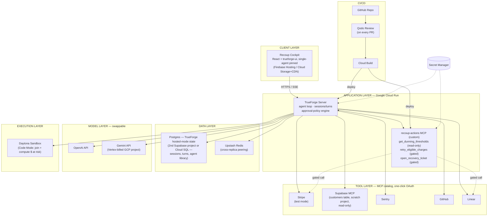
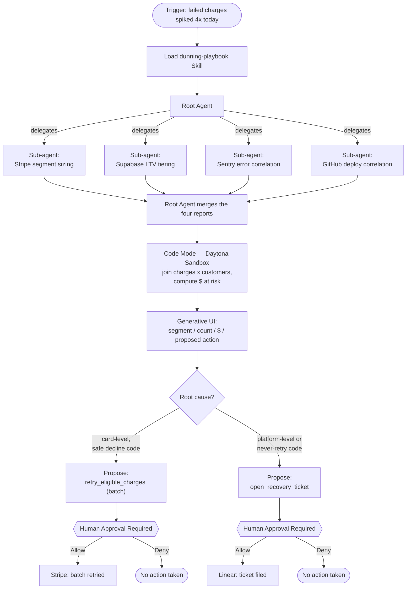

# Architecture

## System overview

Note: the customers table is reached **through the Supabase MCP connector** (tool layer),
not as a direct database connection — TrueForge's only direct Postgres connection is its
own state database (`DATABASE_URL`). Keep those two in separate projects: never let the
agent's data connector and the harness's operational database be the same place.

Addendum (Phase 5.5/5.6/3.3): `recoup-actions` itself will also get a narrow, read-only
Postgres connection to the *business-data* Supabase project — separate from the agent's
MCP-mediated access above — so the server can independently verify decline code and LTV
tier before retrying, and read/write the `dunning_policy` and `recovery_ledger` tables.
This is not a duplicate path to the same data for the same reason: the agent's MCP
access is for broad investigative reads; the server's is a narrow, specific lookup for a
safety check it must not have to trust the agent for.

## What happens inside one investigation

## Layer-by-layer rationale

| Layer | Choice | Why |
|---|---|---|
| Client | React + `@truefoundry/trueforge-ui`, `SingleAgent` mode | A single-purpose product surface, not an agent browser — see `docs/UI_UX_SPEC.md` |
| Application | Cloud Run (2 services: TrueForge server, `recoup-actions` MCP) | Serverless, scale-to-zero, deployable directly by an MCP server (see `docs/MCP_TOOLKIT.md`) |
| Data | Supabase free tier, own scratch project, `@read-only` | Already a one-click OAuth catalog entry — no custom query tool needed |
| Cross-replica peering | Upstash Redis | Cloud Run + hosted mode with >1 replica needs Redis for streams/cancellations to follow the client; Upstash needs no VPC connector, unlike Memorystore |
| Models | OpenAI + Gemini (Vertex-billed) | TrueForge's built-in Gemini provider targets the Gemini Developer API (a static key), not raw Vertex OAuth — see the gotcha below |
| Execution | Daytona | The only sandbox provider TrueForge currently supports |
| Tools | Stripe, Supabase, Sentry, GitHub, Linear (catalog) + `recoup-actions` (custom) | Catalog wherever one exists; custom only for the two actions that need batch-shaped, tightly-scoped gating |
| CI/CD | GitHub → Qodo → Cloud Build → Cloud Run | The same merge event that satisfies the hackathon's Qodo requirement also redeploys — no separate release process |

## Known gotchas (found by actually checking, not assumed)

1. **Unannotated custom MCP tools are not auto-gated.** TrueForge resolves
   `require_approval_for_tools: ["@write","@destructive"]` from the MCP tool's own
   `readOnlyHint`/`destructiveHint` annotations — unannotated tools are exempt unless
   named explicitly. `mcp-server/src/index.ts` sets both the annotations *and* names the
   tools explicitly in `agent-spec.json` as defense in depth. Any new write tool needs the
   same treatment.
2. **TrueForge's Gemini provider ≠ Vertex AI OAuth.** It targets
   `generativelanguage.googleapis.com` (a static Gemini Developer API key), not
   `{region}-aiplatform.googleapis.com` (project/location + service-account OAuth).
   Generate a Gemini Developer API key under the same GCP project for billing continuity
   rather than fighting the harness's `custom` provider slot with an hourly-rotating token.
3. **`@truefoundry/trueforge-ui@0.2.4`'s own dependency graph has a real zustand version
   conflict** that breaks a production build unless pinned via `overrides` — already fixed
   in `cockpit/package.json`. Keep the pin until a future release fixes its own ranges.
4. **Code Mode calls still respect approval gates.** If a sandboxed script calls a gated
   tool internally, it pauses exactly like a direct call — budget for it in demo timing.
5. **Stripe timestamps can't be backdated.** Don't try to fake a multi-day trend chart
   from live test-mode API data — bake the baseline into `get_dunning_thresholds` as a
   stated config value instead (see `docs/DEMO_SCRIPT.md`).
6. **Hosted-mode Agent Library isn't scoped per team member.** Anyone who can reach the
   TrueForge instance can open any saved agent. Keep every credential in connector
   configs and Secret Manager, never in agent `instructions`.
