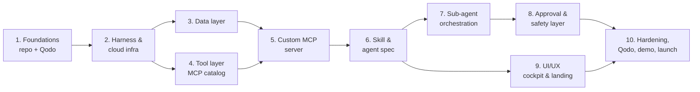

# Phase map

Ten phases, meant to be worked in order. Each has its own file in `docs/phases/` with
numbered sub-parts, an MCP recommendation, an access cross-reference, and exit criteria.
This file is just the shape of the whole build and why the order is what it is.

## Why this order

- **Phase 1 before everything**: Qodo has to be reviewing PRs from the first real commit,
  not bolted on retroactively — the hackathon judges the trail, not just the final state.
- **Phase 2 gates 3 and 4**: nothing else exists without somewhere to run and a database to
  point at.
- **3 and 4 can run in parallel** (different people, if it's a team) — data layer and tool
  layer don't depend on each other, only on infra existing.
- **5 needs both 3 and 4**: the custom MCP server's `get_customer_value`-equivalent logic
  and its Stripe/Linear actions need the data layer and the catalog connectors already
  live to test against.
- **6 is the brain, so it comes after the hands (5) exist** — the skill and agent spec
  reference tools that need to already be real.
- **7 and 8 are two sides of the same coin** (orchestration and safety) and should be built
  together, safety first in practice even though orchestration is listed first — never ship
  working delegation before the approval gate is confirmed working.
- **9 can start as soon as 6 exists** — the cockpit needs an agent to point at, but design
  direction (the landing page, the theme) can and should start earlier in parallel if the
  team has the bandwidth; it's listed after 8 only because that's when the *real* approval
  card behavior is confirmed and the cockpit can be wired against real events instead of
  guesses.
- **10 is last, always**: hardening, the full Qodo pass, rehearsal, and the recording only
  make sense once there's a complete system to harden.

## If solo vs. a team

Solo: work the list top to bottom, exactly as ordered. Team of 2+: split 3/4 and 7/8
across people once 2 is done, resync before 9, all hands on 10.
